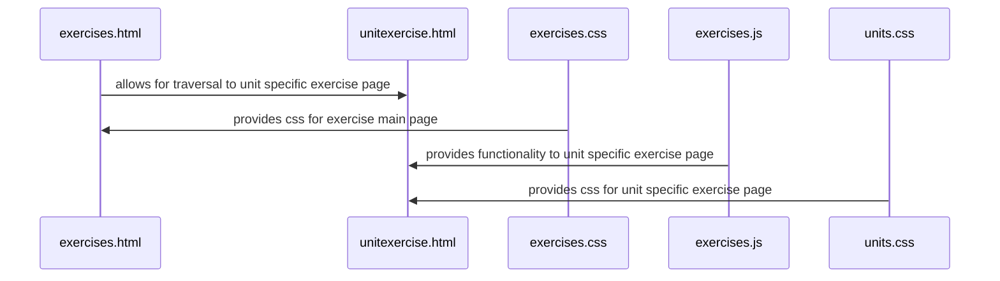

Chosen Feature: Exercise page that quizzes users on 10 random questions connected to the unit they chose.

Description: A page that the user is brought to from the base exercise page, which specifies in the URL which unit the user wants exercises for. The page presents the user with a quiz-style exercise that takes their answers and upon submission tells them what number they got correct, and indicates which questions were correct and incorrect.

Sequence Diagram:

