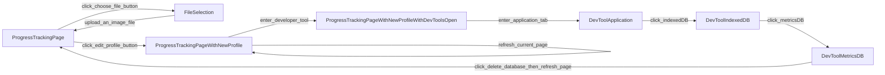

Chosen Feature: Profile Changer, in Progress-Tracking page.

Description: a functionality that allows the user to upload and change their profile picture; the last uploaded file will be stored in IndexedDB.

Sequence Diagram:

